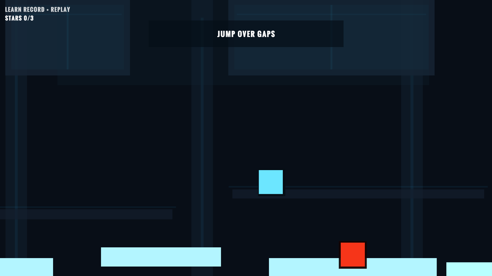
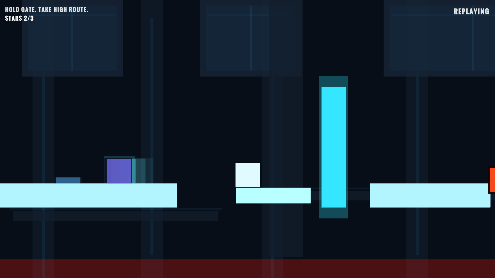
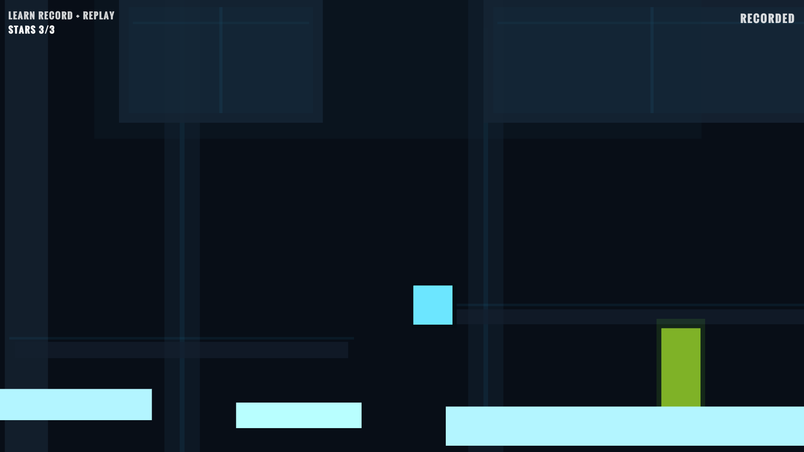

# Shadow Clone

Shadow Clone is a small 2D puzzle-platformer built in Unity where the player records a short movement sequence, replays it as a clone, and uses that clone to solve room-scale logic challenges.

## Project Overview

Shadow Clone is designed as a portfolio-first prototype: one polished mechanic, a short playable arc, and a clean presentation that demonstrates gameplay programming, level scripting, UI flow, and production discipline.

The entire project is intentionally scoped around a single standout idea:

- Record the player's movement for a short duration.
- Spawn one replay clone that follows the recorded path.
- Use the timing between player and clone to press buttons, open doors, avoid hazards, and reach the exit.

## Core Mechanic

The MVP clone system is intentionally simple and reliable:

1. While recording, sample the player's position over time.
2. Save the recorded timeline for a short window.
3. Spawn a single clone actor.
4. Replay the sampled positions at fixed timing.
5. Allow the live player and replay clone to cooperate to solve the puzzle.

This keeps the prototype understandable, debuggable, and realistic for a short development schedule.

## Gameplay Overview

Each level is a compact simulation chamber built around one puzzle concept. The player learns movement, recording, timing, and object interaction through 3 to 4 short levels. The game loop focuses on experimentation:

- Move and inspect the room.
- Start a recording attempt.
- Perform an action path.
- Spawn a clone replay.
- Use the overlap between player and clone to solve the puzzle.
- Reset quickly and try again if timing fails.

## Feature List

- 2D player movement with jump
- Record and replay one clone
- Pressure buttons and linked doors
- Hazards and fast room reset
- Goal zone / level completion
- Main menu, pause, restart, and end flow
- Simple sci-fi UI and audio feedback
- Windows build for portfolio presentation

## Tech Stack

- Unity 2D
- C#
- Unity Input System or classic Input Manager
- TextMeshPro for UI
- Git + GitHub for version control and project presentation

## Controls

Planned default keyboard controls:

- `A / D` or `Left / Right`: Move
- `Space`: Jump
- `R`: Start / stop recording
- `E`: Spawn replay clone
- `Esc`: Pause
- `Tab` or `Backspace`: Restart room

Controls can be adjusted once implementation begins, but they should remain minimal and readable.

## Screenshots

---

---

## Gameplay Video

Placeholder:

- Add a short gameplay GIF to the README once the prototype is playable.
- Add a portfolio video link after final polish and capture.

## Learning Goals

- Build a complete gameplay feature from prototype to polished vertical slice
- Practice clean Unity scene organization and script responsibilities
- Learn how to implement a reliable time-based replay mechanic
- Ship a small finished game instead of an oversized prototype
- Present a project professionally for internship or junior applications

## Current Status

Pre-production / repository setup.

Current focus:

- Define project scope
- Create planning and technical documentation
- Establish implementation roadmap
- Keep the repo professional from day one

## Roadmap Summary

- Phase 0: Foundation and project setup
- Phase 1: Core player controller
- Phase 2: Clone recording and replay
- Phase 3: Puzzle objects and room logic
- Phase 4: Menus, restart flow, and UX
- Phase 5: Build 3 to 4 short levels
- Phase 6: Audio and visual polish
- Phase 7: QA, build export, and portfolio publishing

See [docs/ROADMAP.md](docs/ROADMAP.md) and [docs/ISSUES_BACKLOG.md](docs/ISSUES_BACKLOG.md) for the full plan.

## Installation / How To Run

1. Install Unity Hub.
2. Install the Unity version chosen for this project.
3. Clone or download this repository.
4. Open the project folder in Unity Hub.
5. Open the main bootstrap scene once scenes are created.
6. Press Play in the Unity Editor.

## Build Instructions

1. Open `File > Build Settings`.
2. Select `Windows`.
3. Add the required scenes in the correct order.
4. Set the first menu scene as index `0`.
5. Build to a `Builds/Windows/` folder outside version control.
6. Run the generated `.exe` and verify start-to-finish flow.

## Credits / Assets

Planned approach:

- Prefer self-made placeholder art and UI
- Use small, clearly credited audio assets if needed
- Track all third-party assets and licenses before release

Add final credits here before publishing.

## Future Improvements

These are deliberately out of MVP scope but useful after the first portfolio release:

- Ghost trail visuals for the clone
- Cleaner recording UI feedback
- More expressive level themes
- Better particles and animation juice
- Additional puzzle rooms based on the same core mechanic

## License

This project is released under the MIT License. See [LICENSE](LICENSE).
